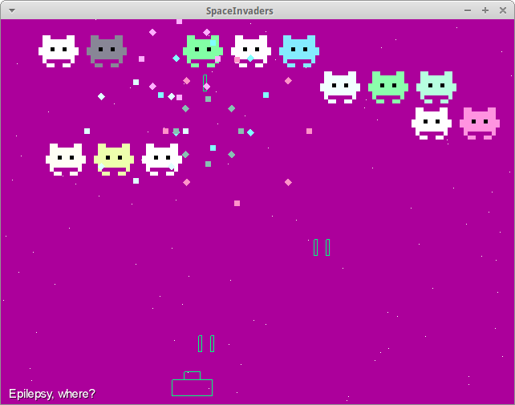

Space Invaders
==============

Space invaders is built with LibGDX and Java

## What's this?

Space invaders is game that was done to learn a lot of java and LibGDX
was showed like a sample of power of LibGDX to my fellow students
on first semester of engineering.

## How play?

You will be start in 'Menu screen' so; only press on 'Space' key to start to
play in the 'space of invaders', in the game you can shoot with 
'Space' and move with keys 'Left' and 'Right'.

If you'll have bad luck loses and then press space to come back to play.

## How play with the code ?

You can clone the project writing something like:

	git clone https://github.com/irvingprog/space-invaders.git

Then will be create a folder named space-invaders that contained the projects
to import from Eclipse IDE.

## License

This program is free software: you can redistribute it and/or modify
it under the terms of the GNU General Public License as published by
the Free Software Foundation, either version 3 of the License, or
(at your option) any later version.

This program is distributed in the hope that it will be useful,
but WITHOUT ANY WARRANTY; without even the implied warranty of
MERCHANTABILITY or FITNESS FOR A PARTICULAR PURPOSE.  See the
GNU General Public License for more details.

You should have received a copy of the GNU General Public License
along with this program.  If not, see <http://www.gnu.org/licenses/>.